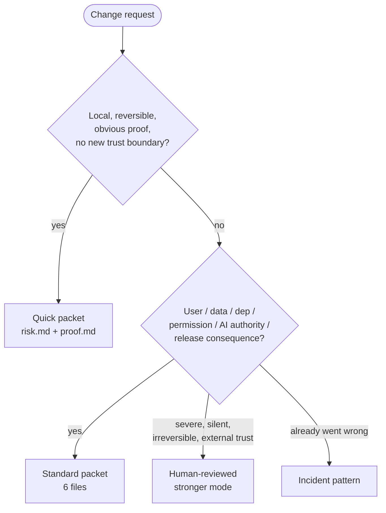

# Nuclear-grade Quickstart

**Goal:** question a real AI-assisted change, build a useful change record in about 15 minutes, and prove one important claim.

Nuclear-grade should make decisions faster, not pile on paperwork. Move fast while you explore and build versions you can throw away. Slow down when you accept a claim, set a baseline (the version everyone agreed is correct), make a public statement, decide on a release, or change what an agent is allowed to do.

> **Note on the demo:** the first time you run `validate` on a fresh packet, expect `FAILED: ... has unfilled template prompts`. Templates ship with empty prompts on purpose. Fill in the prompts that matter, then run `validate` again. The checker is supposed to refuse silent gaps.

## 0. Choose how much to adopt, and let the agent draft

You do not need the whole repository to get value. Most adopters need the **Core 7** habits and one ancillary cluster, picked by trigger. See [`CORE.md`](CORE.md) for the decision matrix and [`starter-kit/`](starter-kit/) for drop-in directories.

The intended loop is **not** "human types out a packet." It is:

```text
user prompt
  -> agent drafts risk.md / proof.md from the query
  -> human edits and approves the draft
  -> agent writes code against the approved spec
  -> human reviews via the validator + the Core habits
```

The human is editor and approver, not typist. Hand-filling the templates step-by-step is the *learning* path below; the *working* path is to have your agent generate the draft from your request and review the draft against the Core habits.

> *Caution.* An agent that drafts its own spec *and* self-validates against a structural check is the "ships green by editing its own test" trap in new clothing. Trust-bearing specs need an independent approver — a human, or a check the agent cannot rewrite. See [`docs/04-adoption/agent-authority-model.md`](docs/04-adoption/agent-authority-model.md).

The numbered steps below walk through the loop by hand so the safety check, the validator, and the habits are visible.

## 1. Check the repo

```bash
python tools/ng.py doctor .
python tools/ng.py list
```

If your shell only has `python3`, use `python3`.

## 2. Pick a real change

Good first changes:

- add an AI-agent permission boundary;
- update a dependency with security relevance;
- change API behavior;
- add an AI tool call;
- prepare a small release.

For the first pass, name the controlled item: the file, prompt, model, dependency, tool permission, release artifact, or doc claim whose state must stay reviewable.

Do not start with a whole platform redesign. Prove one important claim before you grow the packet.

## 3. Question, then classify the mode

Start with a questioning-attitude screen:

```text
Question: What decision are we making?
Assumptions: What must be true?
Facts to verify: What would change the decision?
Stop conditions: What would make us pause or escalate?
Next artifact: Quick proof, Standard spec, context pack, CM record, or release decision.
```

If the decision question is vague, stop there and sharpen it. The rest of the packet exists to answer that question with evidence.

Add HPI controls (small habits from Human Performance Improvement) only when they change the work:

```text
Task preview: What critical action could go wrong?
Self-check: What exact target, expected result, and stop condition apply?
Turnover: What changed, what remains, and who accepts authority next?
OPEX: What durable control changes if a near miss or review surprise appears?
Trust check: What dependency, model, API, SaaS, or vendor claim affects the decision?
```

| If the change is... | Use |
|---|---|
| Low-stakes, easy to undo, easy to prove | Quick |
| User-facing, security-related, dependency-related, a change to AI authority, lasting, or release-facing | Standard |
| High-stakes, hard to undo, carrying outside trust, critical, or close to regulated work | Human-reviewed stronger mode |
| A failure, defect, incident, or near miss | Incident pattern |
| Mostly an architecture or research decision | Research Board pattern |
| A release-readiness decision | Release pattern |



When in doubt, start with Standard and keep the packet thin.

## 4. Create the packet

Quick:

```bash
python tools/ng.py new <slug> --mode quick
```

Standard:

```bash
python tools/ng.py new <slug> --mode standard
```

CM, which means keeping the approved version under control:

```bash
python tools/ng.py new <slug> --mode cm
```

This creates `controlled-items.md`, `change-impact.md`, `baseline.md`, `variance.md`, and `opex.md`. Delete what your change does not need.

Golden path (public questioning-attitude path):

```bash
python tools/ng.py new <slug> --mode golden-path
```

This creates `questioning-attitude.md`, `spec.md`, `turnover.md`, `self-check.md`, and `decision.md`.

Manual fallback:

```bash
mkdir -p .nuclear/changes/<slug>/
cp templates/quick/*.md .nuclear/changes/<slug>/
```

Use either Quick or Standard templates, not both. Add CM or golden-path files only when the change actually needs them.

To upgrade an older packet (0.1.x) that does not declare a mode:

```bash
python tools/ng.py migrate .nuclear/changes/<slug>
```

This adds a `## Selected mode` block to `risk.md` with a best-guess default. Edit it if the guess is wrong.

## 5. Fill the minimum useful version

Answer only what helps a reviewer decide:

1. What decision are we answering?
2. What facts did we find?
3. What are we specifying?
4. What evidence will prove the important claim?
5. What files, tests, dependencies, prompts, models, tools, or release artifacts does it affect?
6. What would push the mode up a level?
7. What decision is needed before release or merge?
8. What baseline, or what trigger to re-check, changes after the decision?
9. What HPI control, if any, changes the next action or what you must prove?

Keep facts, assumptions, unknowns, source claims, local proof, and who decides all separate. Do not let confident writing stand in for evidence.

## 6. Prove one claim

Here is the example that ships with the repo:

```text
Claim: agent writes are limited to the approved workspace root.
Basis: prevent destructive writes outside approved scope.
Control: canonical path guard and workspace containment check.
Evidence: allowed-write test, traversal denial, absolute-path denial, symlink-escape denial, audit event checks.
Ship posture: C-001 passes; broader API and approval-gate chains are deferred, not assumed.
```

Run the example:

```bash
python -m pytest docs/03-worked-examples/ai-agent-tool-permissions/tests/test_workspace_guard.py -q
python tools/ng.py validate docs/03-worked-examples/ai-agent-tool-permissions/.nuclear/changes/add-agent-tool-permissions
```

## 7. Validate your packet

```bash
python tools/ng.py validate .nuclear/changes/<slug>
```

The first run on an untouched packet is **supposed to fail**. Each template ships with a `NUCLEAR-GRADE-PLACEHOLDER` marker line, and the checker refuses any packet that still has it. That is the evidence gate doing its job. Fill in the fields you need, set at least one real status, delete every marker line, and validate again:

```bash
python tools/ng.py validate .nuclear/changes/<slug>
# OK: .nuclear/changes/<slug>
```

For a packet in another repo:

```bash
python tools/ng.py validate /path/to/your/repo/.nuclear/changes/<slug>
```

The v0 checker looks at the structure of Quick and Standard packets, the required sections, the evidence status, the source-lineage notes, the local packet links, the placeholder marker, and banned overclaiming phrases. It does not decide whether your system is safe, secure, compliant, or fit for a regulated use case.

## 8. Decide or stop

Decide to ship or merge only when:

- the exit criteria are met;
- open gaps are either accepted or clearly block the release;
- the verification evidence is repeatable enough for the risk;
- rollback, monitoring, and handoff match the stakes.

Stop or escalate when:

- the change touches sensitive data, money, safety, outside trust, actions you cannot undo, critical operations, or AI authority;
- the proof is flaky, indirect, or missing;
- you do not understand the trust in a dependency, model, API, or tool;
- reviewers cannot tell what changed and why.

## 9. Read next

- [`WORKFLOWS.md`](WORKFLOWS.md)
- [`SKILLS.md`](SKILLS.md)
- [`COMMANDS.md`](COMMANDS.md)
- [`EXAMPLES.md`](EXAMPLES.md)
- [`docs/04-adoption/reviewer-playbook.md`](docs/04-adoption/reviewer-playbook.md)
- [`docs/05-reference/cli-reference.md`](docs/05-reference/cli-reference.md)

## Source-lineage note

This quickstart is an original software workflow built on Nuclear-grade's public source foundation and operating-system docs. It does not create formal V&V, compliance, certification, safety, security, or regulatory adequacy.
