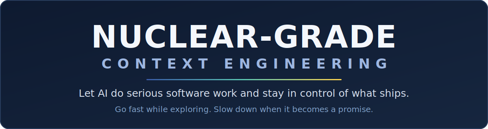
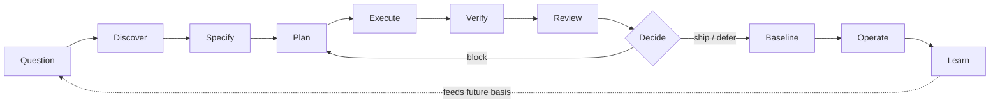
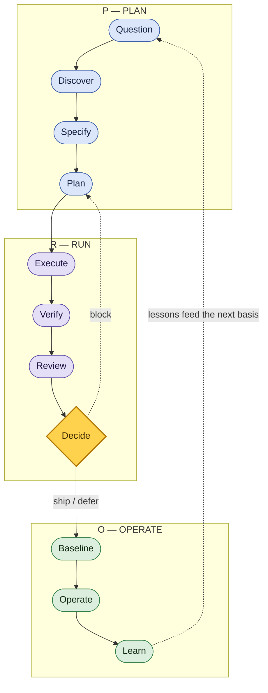
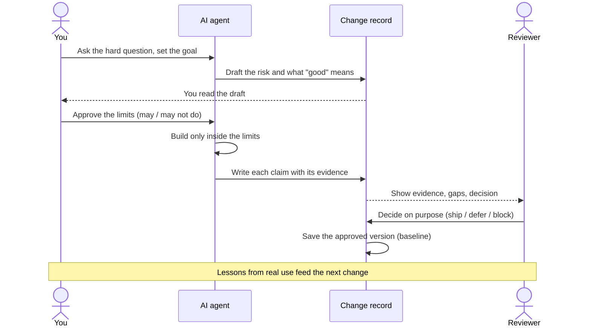
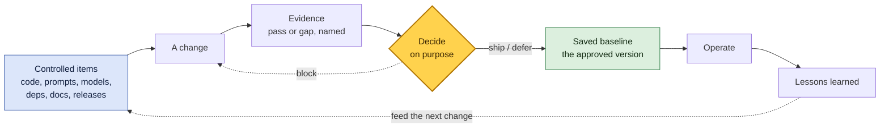
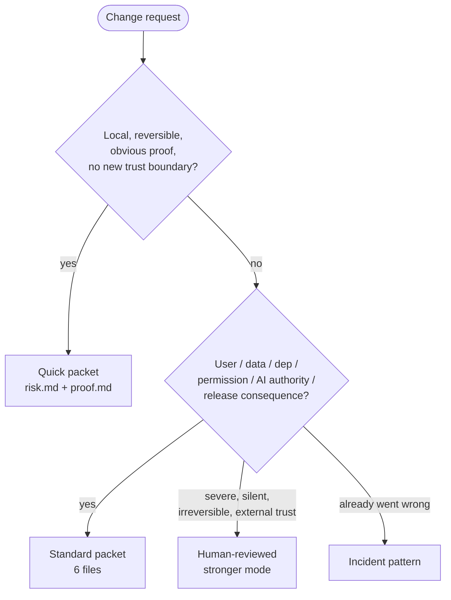

<div align="center">



<br/>

**A simple, evidence-first way to let AI do serious software work and stay in control of what ships.**

[](https://github.com/FlyFission/nuclear-grade-context-engineering/actions/workflows/ci.yml)
[](LICENSE)
[](pyproject.toml)
[](#quick-start)
[](CONTRIBUTING.md)

</div>

# Nuclear Grade Context Engineering

AI agents no longer just suggest code. They edit files, change prompts, call tools, swap dependencies, write the evidence, and help ship releases. That is a lot of power with very little ceremony. Nuclear-grade gives that work a clear path you stay in control of, so you can move fast and still stand behind what ships.

You do not need to read the whole repo to start. Run one command in [See it work, then make it yours](#see-it-work-then-make-it-yours), copy one folder, and add the rest only when a change earns it.

## Why this exists

I have spent over a decade in the nuclear field, and I run [FlyFission Consulting Group](https://flyfission.com/), an independent design-review and advisory practice for nuclear projects. That work teaches one durable lesson: complex systems rarely fail in one big step. They fail when authority outruns evidence, one reasonable-looking shortcut at a time.

AI agents are gaining exactly that kind of authority over codebases. This repo ports the habits that keep high-consequence engineering honest (a questioning attitude, configuration management, evidence before decisions) into a shape software teams can use at AI speed. It borrows the discipline, not the regulations: see [What this is NOT](#what-this-is-not).

## Contents

- [Why this exists](#why-this-exists)
- [What this is](#what-this-is)
- [The one idea](#the-one-idea)
- [See it work, then make it yours](#see-it-work-then-make-it-yours)
- [How one change flows](#how-one-change-flows)
- [Who does what](#who-does-what)
- [Keeping the approved version under control](#keeping-the-approved-version-under-control)
- [The common way vs. the nuclear-grade way](#the-common-way-vs-the-nuclear-grade-way)
- [Does it actually help?](#does-it-actually-help)
- [What you get](#what-you-get)
- [Adopt at your pace](#adopt-at-your-pace)
- [Who this is for](#who-this-is-for)
- [Quick start](#quick-start)
- [Works across your tools](#works-across-your-tools)
- [What this is NOT](#what-this-is-not)
- [License and limits](#license-and-limits)
- [Project, sources, and author](#project-sources-and-author)

## What this is

Before an agent builds, you ask hard questions and find the facts. You write down what the change must do. The agent works only inside the limits you set. Then you check the claims against real evidence, decide on purpose, lock the version you trust, put it to work, and learn from what happens next.

The discipline is borrowed from how high-consequence engineering is run: question your assumptions, prove your claims, and never let standards slip one small step at a time. The name is the standard of care, not the vocabulary. Keep the discipline and rename the local copy if "nuclear-grade" would mis-calibrate your team (see [`DISCLAIMER.md`](DISCLAIMER.md)).

## The one idea

**Go fast while you are exploring. Slow down the moment the work becomes a promise.**

An agent can try ideas and throw them away cheaply, so let it. But the rules tighten as soon as the work turns into a claim, a file you have to keep under control, a public statement, an approved version, a release call, or a change to what the agent is allowed to do.

So the first question is the one that matters most: **what does this change have to prove, and what fact would change my decision?**

That question has a shape, and the shape has a name.

### Become a PRO by learning to PROVE

The kind of software engineering people stake decisions on runs on one habit: you **PROVE** every claim. Five moves, in order:

> **PROVE**: Plan · Run · Observe · Verdict · Educate

(Observe = weigh the evidence; Verdict = decide on purpose; Educate = ship the result, then learn from how it runs.) The same path at a glance is three moves, **PRO**: Plan · Run · Operate — up close it's PROVE, from across the room it's PRO. The step it never lets you fold away is **Verdict**, where a draft becomes a decision: ship it and you can defend every line.

```text
Normal AI coding:
prompt -> diff -> persuasion -> merge risk

Nuclear-grade:
question -> specify -> execute -> verify -> decide -> baseline -> operate -> learn
```

Nuclear-grade is a working toolkit you can use today: skills an agent can follow, command prompts you can paste, templates for small and large changes, a small command-line tool, a checker, a public list of sources, one fully worked example, and one hands-on comparison study.

## See it work, then make it yours

The repo ships a finished change record for the kind of change that should make you a little nervous: giving an AI agent permission to write files and call external APIs. It ships with passing evidence for the claim that matters most (the agent cannot write outside its workspace), and named gaps for the claims still open. Clone it and read that evidence with one command. No install, no build step, standard library only (you need `git` and Python 3.11+, and `python3` if your shell has no `python`):

```bash
git clone https://github.com/FlyFission/nuclear-grade-context-engineering
cd nuclear-grade-context-engineering
python tools/ng.py validate docs/03-worked-examples/ai-agent-tool-permissions/.nuclear/changes/add-agent-tool-permissions
# OK: the record links every permission claim to its evidence (or a named gap).
```

Want to watch that evidence regenerate? The example ships the test behind that workspace-boundary claim. This step needs `pytest` (`pip install pytest`); nothing else in the repo does:

```bash
python -m pytest docs/03-worked-examples/ai-agent-tool-permissions/tests/test_workspace_guard.py -v
# 4 passed: every write outside the agent's workspace was denied and logged.
```

That packet is a complete Standard record: `risk.md`, `basis.md`, `plan.md`, `trace.md`, `verification.md`, and `ship.md`, plus an `adversarial-review.md` this high-stakes example adds on top. Copy [`docs/03-worked-examples/ai-agent-tool-permissions/`](docs/03-worked-examples/ai-agent-tool-permissions/) as the template for your own changes, keep [`CORE.md`](CORE.md) open for the seven habits behind it, and take the full guided tour in [`QUICKSTART.md`](QUICKSTART.md) when you want depth. It is a worked teaching example, not a production guarantee — see [What this is NOT](#what-this-is-not).

## How one change flows

Every change walks the same path: the headline above, shown in full. Each step is a control point: it stops one specific failure and produces one artifact you can point at. A skipped step is not a shortcut; it is a named failure mode you chose to accept.

```text
Question -> Discover -> Specify -> Plan -> Execute -> Verify -> Review -> Decide -> Baseline -> Operate -> Learn
```



Those eleven beats are the same path zoomed in. Zoomed out, they're three moves (**PRO**: Plan · Run · Operate) or five with the gate named (**PROVE**: Plan · Run · Observe · Verdict · Educate) — one path, three levels of detail:



*If the diagrams above do not render (for example on PyPI), the eleven-beat line just above is the same path in text.* The control-point detail (what each step stops and produces) is in [`WORKFLOWS.md`](WORKFLOWS.md), and every diagram here is canonical in [`docs/diagrams.md`](docs/diagrams.md).

Underneath the path sit a few **optional** habits borrowed from high-reliability work — **HPI for AI agents** (Human Performance Improvement). Reach for them only when they change the outcome: brief the work before a risky step, double-check critical actions, hand off cleanly, get a second set of eyes when trust is on the line, and capture the lesson after a near miss. [`WORKFLOWS.md`](WORKFLOWS.md) covers them.

## Who does what

Four roles share the work: **you**, the **AI agent**, the **change record**, and the **reviewer**. The agent moves fast, but only inside limits you approve first. The record carries each claim and its evidence. The reviewer decides on the evidence, not the pitch.



**In words:** you ask and set the goal → the agent drafts the risk and what "good" means → you approve the limits → the agent builds only inside them → the agent writes each claim with its evidence → the reviewer checks the evidence and decides (ship / defer / block) → the approved version is saved as the baseline → lessons from real use feed the next change. Canonical copy in [`docs/diagrams.md`](docs/diagrams.md).

## Keeping the approved version under control

You already have git, CI, and branch protection. Keep them; this rides on top, it does not replace them. What they do not give you is the *decision*: a green pipeline says the suite passed on some commit, not that a human weighed the leftover risk and chose to ship, and not what would force a re-check. And they were never aimed at the things that now drive an AI system's behavior: the prompts, the model IDs, the eval sets, the agent's own permissions. Git versions your code; none of it records *why this is the version you trust*.

A **baseline** closes that gap. It is the version everyone agreed is correct, plus the evidence behind the agreement. Changes never edit the baseline directly; they go through evidence and a decision first, and only an accepted change becomes the new baseline. That is configuration management, in one loop:



**In words:** controlled items (code, prompts, models, dependencies, docs, releases) → a change → named evidence (pass or gap) → a deliberate decision → if ship or defer, save the new baseline; if block, back to the change → operate the baseline → lessons feed the next change. You only add the heavier records (what is under control, ripple effects, the saved baseline, drift, and operating lessons) when the stakes are high enough to earn them. Canonical copy in [`docs/diagrams.md`](docs/diagrams.md).

## The common way vs. the nuclear-grade way

| The common way | The nuclear-grade way |
|---|---|
| Ask an agent, look at the diff, run the tests. | Question the assumptions, name what must stay under control, write down the intent, check the evidence, then decide on purpose and record what you trust. |
| The pull request text tries to talk reviewers into a yes. | A change record links intent, what must not break, what is under control, the evidence, the gaps, and the decision. |
| Agents get broad access and vague instructions. | Agents get a role, a list of what they may do, what they may not do, what they must prove, where the work stands, and when to stop. |
| Green tests become the reason to ship. | The release record states the evidence, the leftover risk, the rollback plan, what to watch, the decision, and what to save. |
| Lessons disappear into the chat history. | Lessons from real operation feed back into future plans, tests, monitors, and controls. |

The shift, in one view:

```text
review the diff           -> review the whole approved setup
trust the prompt history  -> keep a controlled record of the change
hand the agent free rein  -> hand it focused context and a duty to prove
treat green tests as a yes -> make an explicit release decision and record what you trust
```

This earns its keep. Instructions should be hard to misuse, small actions should still serve the goal, and "I'm confident" should never get mistaken for "here is the proof."

## Does it actually help?

We ran twelve realistic changes both ways, a direct coding-agent prompt versus these skills and workflows, and scored each on decision clarity, hidden-risk discovery, evidence quality, and ship-or-defer usefulness, with overhead tracked separately so the cost shows up next to the benefit. On a tiny, reversible doc fix the two landed within a point on every axis: the extra rigor was not worth the overhead, and plain prompting was enough. But on changes where a mistake is expensive and hard to walk back (an agent gaining file and API authority, a data-retention migration, a payment path, a release cut), plain prompting scored **1–2 out of 5** at surfacing hidden risk and at producing a defensible ship-or-defer call, while Nuclear-grade scored **4–5**, and it cost more overhead every time. The biggest gains were in hidden-risk discovery, and the rule matches the one idea: spend the rigor where the consequence lives.

The scores are author-judged design evidence, not proof of effectiveness, and the limits are stated up front. The rubric, the methodology, and every trial record are public: [results](docs/03-worked-examples/skill-workflow-comparison/results-summary.md) · [methodology](docs/03-worked-examples/skill-workflow-comparison/methodology.md). Replication is invited.

## What you get

| Part | What it does | Start here |
|---|---|---|
| Workflows | Step-by-step paths for small changes, big changes, and the careful checks in between | [`WORKFLOWS.md`](WORKFLOWS.md) |
| Skills | Instructions an agent can follow, each with inputs, outputs, how to verify, when to stop, and warning signs | [`SKILLS.md`](SKILLS.md) |
| Command prompts | Ready-to-paste prompt cards for questioning, sorting risk, checking impact, saving an approved version, reviewing evidence, release checks, and more | [`COMMANDS.md`](COMMANDS.md) |
| Templates | Fill-in records for small changes, standard changes, and high-consequence ones | [`templates/`](templates/) |
| Command-line tool | `init`, `new`, `validate`, `doctor`, `list`, `status`, `migrate`, `tokens` | [`docs/05-reference/cli-reference.md`](docs/05-reference/cli-reference.md) |
| Checker | The dependency-free check behind `ng.py validate`, for small and standard change records | [`tools/ng_validate.py`](tools/ng_validate.py) |
| Worked example | A real change record proving an AI agent stayed inside its workspace | [`EXAMPLES.md`](EXAMPLES.md) |
| Sources | The public ideas this borrows from, and how to talk about them safely | [`docs/00-standards-foundation/source-map.md`](docs/00-standards-foundation/source-map.md) |

The live list is the source of truth (see [`nuclear-grade.yaml`](nuclear-grade.yaml), [`SKILLS.md`](SKILLS.md), and [`COMMANDS.md`](COMMANDS.md)); treat any count here as a snapshot, not a promise.

### Map of the repo

```text
skills/                         skills an agent can follow
commands/                       paste-ready command prompts
templates/                      fill-in records for small, standard, and high-consequence changes
starter-kit/                    ready-made bundles to drop into a project
tools/                          the command-line tool and the checker
tests/                          tests for the checker, the tool, the contracts, and the public docs
docs/00-standards-foundation/   sources, safe citation, compliance boundaries
docs/01-field-guide/            how each source idea maps to a plain concept, incl. the leadership and high-reliability guide
docs/02-operating-system/       the path, the habits, the modes, the records, the checks, authority and intent, incidents, deficiencies
docs/03-worked-examples/        the flagship worked example and the comparison study
docs/04-adoption/               rollout, agent permissions, reviewer playbook
docs/05-reference/              the skill, command, and tool contracts
docs/diagrams.md                visual maps of the path, modes, skills, and records
docs/glossary.md                plain-language decoding of terms and idioms
```

## Adopt at your pace

You do not adopt the whole system on day one; rigor scales with consequence, not effort.

- **Start with seven always-on habits** (the Core 7): they fit any change. See [`CORE.md`](CORE.md).
- **Add clusters by consequence**: bring in the heavier skills, templates, and records only when a change touches users, data, dependencies, permissions, AI authority, or a release.
- **Grow into the full system**: the complete skill set, command prompts, and modes once your team has tested the lighter path.

Ready-made bundles live in [`starter-kit/`](starter-kit/), and [`CORE.md`](CORE.md) has a decision matrix that picks the right kit for your project by trigger.

**Which change record do you need?** This release checks two kinds, both kept under `.nuclear/changes/<name>/`:



**In words / which files:**

| Kind | Use it when | Files |
|---|---|---|
| Quick | Low stakes, easy to undo, obvious proof, no new trust boundary | `risk.md`, `proof.md` |
| Standard | It touches users, dependencies, permissions, data, AI behavior, operations, or a release | `risk.md`, `basis.md`, `plan.md`, `trace.md`, `verification.md`, `ship.md` |

The heavier patterns (high-consequence, incident, research-board, and release) are written down here, but for now treat them as human-reviewed until your own project has tested them.

## Who this is for

Use Nuclear-grade if you are:

- building AI agents that write files, call APIs, use credentials, approve actions, or affect releases;
- using coding agents on work that matters more than a throwaway script;
- reviewing AI-assisted pull requests and want evidence instead of a sales pitch;
- leading a team that wants speed without losing the plot on risk and releases;
- building internal workflows where people and agents both need focused context and a duty to prove their claims.

## Quick start

**Claude Code.** This repository is its own plugin marketplace. Add it and install the plugin, then reload to activate it in the current session:

```bash
/plugin marketplace add FlyFission/nuclear-grade-context-engineering
/plugin install nuclear-grade@nuclear-grade
/reload-plugins   # or restart Claude Code; loads the new skills/commands into this session
```

That exposes the skills and command prompts as a plugin. No hooks are configured, so nothing runs automatically; the install copies the repo's `ng` CLI into the plugin cache, but the plugin adds no `ng` command to your `PATH` and runs nothing on its own; the CLI is a repo-side tool you run from a checkout (below). Prefer plain files, or using another tool? Use the repo directly:

1. **Get the tool.** Clone the repo and install it (no third-party dependencies). See [`INSTALL.md`](INSTALL.md).
2. **Check your setup.** Run `python tools/ng.py doctor .` to confirm things are wired up, and `python tools/ng.py list` to see what is available.
3. **Make your first record.** Run `python tools/ng.py new <slug> --mode quick`, fill in the two files, then prove it with `python tools/ng.py validate .nuclear/changes/<slug>`.

If your shell only has `python3`, use `python3`. The full guided tour is in [`QUICKSTART.md`](QUICKSTART.md). **Using an AI agent? Point it at [`AGENTS.md`](AGENTS.md)**: it is the shared brief agents read first.

## Works across your tools

Cursor, Claude Code, Aider, Codex, and Copilot each read slightly different files for their reasoning and rules. `.nuclear/`, [`AGENTS.md`](AGENTS.md), and the `SKILL.md` contract are a **shared, tool-agnostic shape** that all of them can import as plain markdown: a portable surface for agent authority, change records, and evidence. No matter which IDE ships reasoning steps natively, the packets and habits travel with the repository.

Two tools also have native plugin packages: **Claude Code** (the repo is its own marketplace — skills, command prompts, and PROVE subagents) and **Codex** (`.codex-plugin/plugin.json`, which exports the **skills** only). For what each plugin does and does not install — and why Codex users should still clone the repo for the full workflow — see [`INTEGRATIONS.md`](INTEGRATIONS.md) and [`INSTALL.md`](INSTALL.md).

## What this is NOT

Nuclear-grade is not a compliance program, a certification, a regulated quality-assurance system, a safety analysis, a production sandbox, a regulatory submission, legal advice, or a substitute for qualified engineering, legal, security, safety, or compliance review.

It does not claim that any system is safe, secure, compliant, approved, certified, or fit for regulated use.

Read these before you use it:

- [`DISCLAIMER.md`](DISCLAIMER.md)
- [`docs/00-standards-foundation/compliance-boundaries.md`](docs/00-standards-foundation/compliance-boundaries.md)
- [`docs/00-standards-foundation/do-not-cite-directly.md`](docs/00-standards-foundation/do-not-cite-directly.md)

The comparison study is honest about its limits: it is author-judged across twelve scenarios, design evidence not proof of effectiveness. See [`docs/03-worked-examples/skill-workflow-comparison/methodology.md`](docs/03-worked-examples/skill-workflow-comparison/methodology.md) for what the trials measure and what they do not.

## License and limits

Nuclear-grade is released under the [`MIT License`](LICENSE). You may use, copy, change, publish, distribute, sublicense, and sell copies under the license terms.

That permission is not a promise about quality. Using this repo does not create formal verification and validation, NQA-1 evidence, NQA-1 record, compliance, certification, regulatory approval, or any safety, security, procurement, production, warranty, or support guarantee.

The public sources named here are influences and idea lineage. They are not standards this repo claims to meet.

## Project, sources, and author

| Topic | Where |
|---|---|
| Questions and ideas | [GitHub Discussions](https://github.com/FlyFission/nuclear-grade-context-engineering/discussions) |
| How to contribute | [`CONTRIBUTING.md`](CONTRIBUTING.md) |
| How decisions are made | [`GOVERNANCE.md`](GOVERNANCE.md) |
| Reporting a vulnerability | [`SECURITY.md`](SECURITY.md) |
| Community expectations | [`CODE_OF_CONDUCT.md`](CODE_OF_CONDUCT.md) |
| Getting help | [`SUPPORT.md`](SUPPORT.md) |
| Where this is going | [`ROADMAP.md`](ROADMAP.md) |
| What changed | [`CHANGELOG.md`](CHANGELOG.md) |
| The principles in short form | [`MAXIMS.md`](MAXIMS.md) |
| Citing this work | [`CITATION.cff`](CITATION.cff) |

Nuclear-grade is an original software workflow inspired by public sources. The source families are mapped in [`docs/00-standards-foundation/source-map.md`](docs/00-standards-foundation/source-map.md) and translated into plain concepts in [`docs/01-field-guide/source-to-concept-crosswalk.md`](docs/01-field-guide/source-to-concept-crosswalk.md).

Written and maintained by **Ben Huffer** ([@FlyFission](https://github.com/FlyFission)), founder of [FlyFission Consulting Group](https://flyfission.com/), an independent design-review and project-advisory practice for nuclear projects. Questions and field stories are welcome in [Discussions](https://github.com/FlyFission/nuclear-grade-context-engineering/discussions) or on [LinkedIn](https://www.linkedin.com/in/ben-huffer-646bab67/).
