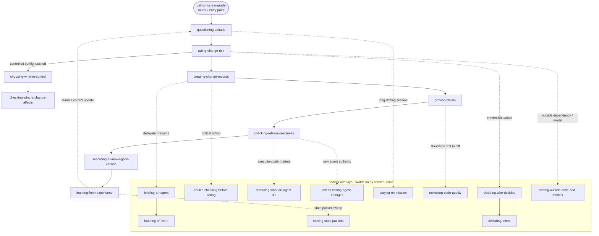

# Nuclear-grade Skills

A skill is a self-contained set of instructions an agent can follow. Each one lives in a `SKILL.md` file that says when to use it, what it needs, the steps to take, what it produces, the one decision it can change, how to check the result, when to stop and ask for help, the excuses to watch for, and where the idea comes from.

## The skills

| Skill | Use it when | What you get |
|---|---|---|
| [`questioning-attitude`](skills/questioning-attitude/SKILL.md) | You need to challenge assumptions before work, review, or a release moves ahead | The assumptions, the gaps in evidence, and clear stop conditions |
| [`using-nuclear-grade`](skills/using-nuclear-grade/SKILL.md) | You are starting to use this workflow on a change or a repo | The right mode, where the record goes, and the path to evidence |
| [`choosing-what-to-control`](skills/choosing-what-to-control/SKILL.md) | You need to decide which files and settings must stay under control | A short list of what to keep under control |
| [`checking-what-a-change-affects`](skills/checking-what-a-change-affects/SKILL.md) | You want to know what else a change touches and what must be re-checked | A list of ripple effects and re-check triggers |
| [`recording-a-known-good-version`](skills/recording-a-known-good-version/SKILL.md) | You want to record the exact version everyone agreed is correct | A saved "known-good" record (a baseline) |
| [`rating-change-risk`](skills/rating-change-risk/SKILL.md) | You need to pick how careful to be: quick, standard, or stronger | The chosen mode and what it must prove |
| [`creating-change-records`](skills/creating-change-records/SKILL.md) | You are creating or updating the files that record a change | A filled-in quick or standard change record |
| [`briefing-an-agent`](skills/briefing-an-agent/SKILL.md) | You are about to hand an agent or reviewer a focused, bounded task | A tight briefing pack for the agent |
| [`handing-off-work`](skills/handing-off-work/SKILL.md) | You are passing unfinished work to another agent, a reviewer, or your future self | A clean handoff record |
| [`double-checking-before-acting`](skills/double-checking-before-acting/SKILL.md) | An agent is about to do something risky: a big edit, a command, a public claim, a trust change, or a release | A short self-check record |
| [`proving-claims`](skills/proving-claims/SKILL.md) | You need to tie each claim to the evidence that backs it | A claim-to-evidence table with the gaps marked |
| [`checking-release-readiness`](skills/checking-release-readiness/SKILL.md) | You have to decide: ship, block, defer, or ship with known risk | A clear release decision |
| [`learning-from-experience`](skills/learning-from-experience/SKILL.md) | A near miss, a bad handoff, or a surprise in review should turn into a lasting fix | A concrete follow-up action |
| [`vetting-outside-code-and-models`](skills/vetting-outside-code-and-models/SKILL.md) | You are bringing in a dependency, model, API, SaaS, or generated artifact you did not write | A trust check tied to how you will actually use it |
| [`checking-source-claims`](skills/checking-source-claims/SKILL.md) | You are about to cite a source or claim where an idea came from | Wording that is honest about the source |
| [`checking-legal-and-safety-wording`](skills/checking-legal-and-safety-wording/SKILL.md) | You are reviewing license, warranty, or safety language | Wording that stays inside the real limits |
| [`staying-on-mission`](skills/staying-on-mission/SKILL.md) | The work is drifting from the goal, scope is creeping, or standards are slipping one step at a time | A decision to re-anchor, escalate, or stop, plus the restated goal |
| [`reviewing-code-quality`](skills/reviewing-code-quality/SKILL.md) | You are reviewing a diff or module for sloppy standards and needless complexity | Ranked findings and one clear verdict |
| [`stress-testing-agent-changes`](skills/stress-testing-agent-changes/SKILL.md) | You want to attack your own agent change before someone else does: injection, escalation, unsafe output, tool misuse | A record of what you tried and what you found |
| [`recording-what-an-agent-did`](skills/recording-what-an-agent-did/SKILL.md) | You need a clear record of an agent's tool calls, decisions, inputs, outputs, token use, and approvals | A structured run record |
| [`breaking-down-the-work`](skills/breaking-down-the-work/SKILL.md) | You need to split an epic, feature, or system into clean pieces with no gaps and no overlaps | A work-breakdown table and a short dictionary |
| [`organizing-project-folders`](skills/organizing-project-folders/SKILL.md) | You are laying out a repo or workspace, placing a file, or fixing a junk-drawer folder | A folder map and a naming and depth check |
| [`closing-stale-packets`](skills/closing-stale-packets/SKILL.md) | A change record has gone stale or half-filled and `ng status` flagged it | A finished, closed-with-reason, or deleted record |
| [`deciding-who-decides`](skills/deciding-who-decides/SKILL.md) | An agent could act on something irreversible, trust-bearing, or thinly evidenced and you must place authority | A decision-rights line with who decides and the escalation trigger |
| [`declaring-intent`](skills/declaring-intent/SKILL.md) | Before a critical or irreversible action you want a reviewer to challenge the thinking, not just the result | An intent declaration or release brief with expected result, abort criteria, and rollback |
| [`responding-to-incidents`](skills/responding-to-incidents/SKILL.md) | Production is broken, data is at risk, or an agent action caused harm and you must stabilize first | An incident record with one commander, a fact-vs-hypothesis timeline, and owned corrective actions |
| [`tracking-deficiencies`](skills/tracking-deficiencies/SKILL.md) | A known problem will outlive a single change and must be owned, not normalized | A deficiency register entry that is aged, owned, and fixed or formally risk-accepted |

## How the skills compose

`using-nuclear-grade` is the way in and the router. From there the main path runs question -> rate risk -> create -> prove -> check release -> baseline -> learn, and the heavier overlays switch on only when the stakes call for them. Reach for an overlay when its trigger fires, not by default.

The diagram below is the full-system view. For cherry-pick adoption see [`CORE.md`](CORE.md): seven core habits (`questioning-attitude`, `rating-change-risk`, `proving-claims`, `double-checking-before-acting`, `staying-on-mission`, `checking-release-readiness`, `learning-from-experience`) plus the decision matrix that invokes the ancillary clusters by trigger.

**Consequence note.** If your agent has write, run, network, or approval authority over its own working set, treat `deciding-who-decides`, `declaring-intent`, `stress-testing-agent-changes`, `vetting-outside-code-and-models`, `recording-what-an-agent-did`, `briefing-an-agent`, and `handing-off-work` as **main-path, not overlay** — the trigger is always on for you. The agent-tool-permissions worked example is your template. See the Agent-authority row in [`CORE.md`](CORE.md)'s decision matrix.

See [`docs/diagrams.md`](docs/diagrams.md) for the lifecycle, mode, and packet diagrams.
See [`docs/05-reference/skills-token-audit.md`](docs/05-reference/skills-token-audit.md) for the measured token cost of these skills and the `ng tokens` budget gate.

## What every skill must include

Each `SKILL.md` must have:

- A short header (called YAML frontmatter) with a `name` and a `description`. A `license` and a `compatibility` note are optional.
- A `name` that is all lowercase with words joined by hyphens.
- A `description` that says what the skill does, when to reach for it, and a clear "Do not use for ..." line. It must be 80 to 500 characters and must not contain a colon followed by a space.
- These sections: Overview, a decision contract (the one decision the skill can change and its tier -- block, warn, or observe), when to use it, when not to use it, inputs, the process, outputs, how to verify, when to escalate, the common excuses to watch for, the red flags, and a short note on where the idea comes from.

A skill can add optional `references/`, `scripts/`, and `assets/` folders so an agent can pull in detail only when it needs it. See `docs/05-reference/skill-authoring-contract.md`.

## A note on limits

Skills help an agent keep its evidence and boundaries intact. They do not create formal verification and validation, compliance, certification, or any safety, security, or regulatory guarantee.
