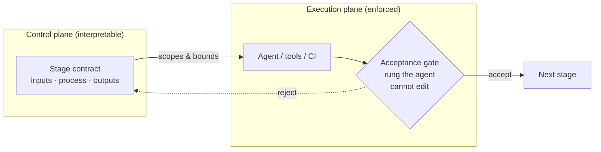

# Agentic Workflow Architecture

**Purpose:** Make probabilistic AI work inside repeatable, reviewable, deterministic-enough
engineering workflows. This page names the architecture pattern behind that goal — the **stage
contract** — and positions it against the one question this repo keeps asking: *can the thing a
control governs defeat the control by editing it?*

**Status:** Operating doctrine. It draws on public agentic-workflow research and on this repo's
own enforcement model. It creates no certification, audit evidence, or fitness claim; see the
boundary note below.

---

## 1. The principle

Put **deterministic controls around probabilistic model calls.** A model call is the
probabilistic center — its output varies, even at low temperature. Everything around it (the
inputs it is shown, the tools it may use, the checks that accept its output, the gate that
ships it) can and should be deterministic, bounded, and inspectable.

The folder-and-markdown pattern from the Model Workspace Protocol (Van Clief and McDermott,
arXiv:2603.16021) is one good shape for that deterministic shell: numbered stages set the
order, markdown carries the context, and local scripts do the mechanical work. This repo
already teaches it in [`organizing-project-folders`](../../skills/organizing-project-folders/SKILL.md)
and shows it in the [agentic-folder worked example](../03-worked-examples/agentic-folder-structure/README.md).
This page makes the *enforcement* explicit.

## 2. Control plane vs execution plane

The clearest way to keep the pattern honest is to split two planes and let each do what it is
good at.

| Plane | What lives there | What it is good at |
|---|---|---|
| **Control plane** | Git, markdown, stage contracts, skills, templates, baselines, the change packet | Interpretability, diffability, human review, slow careful gates |
| **Execution plane** | Tools, agents, shells, APIs, CI, test runners, durable runtimes | Retries, resumability, concurrency, side effects, scale |

The Model Workspace Protocol is a strong *control plane*. It is not, by itself, an execution
plane — and it should not be sold as one. When a workflow needs persistence across crashes,
distributed retries, multi-user queues, or high-volume runs, the durable runtime belongs in the
execution plane; the folder system stays the human-readable control surface on top.

### How this maps onto PROVE

The repo's [PROVE pipeline](../../agents/README.md) already embodies the split:

- The [**planner**](../../agents/planner.md) is read-only over product code and writes the
  stage contract — it is the **control plane**. It defines, before any build, what each slice
  is shown and what it must not touch.
- The [**runner**](../../agents/runner.md) is the only stage with build authority and is **held
  to** the contract — it is the **execution plane**. A fan-out slice gets only its contract's
  inputs, never the whole plan.

This is the answer to "enforce it on the other side": the interpretable contract is written on
the planning side; the gate that accepts the work sits on the execution side, at a rung the
producing agent cannot rewrite.

## 3. The stage contract

A stage contract converts a stage's latent prompt assumptions into an explicit interface:
**Inputs / Process / Outputs**, plus the fields that make it enforceable. The full form is in
[`templates/standard/stage-contract.md`](../../templates/standard/stage-contract.md). Its
load-bearing parts:

- **Selective section routing.** Inputs point to exact `file#section` locations, split into
  Layer-3 references (rules to follow) and Layer-4 prior outputs (artifacts to work on), with a
  context budget. This is the same discipline as
  [context-window-discipline](context-window-discipline.md): show the smallest honest context.
- **Enforcement rung.** Every contract names the rung that accepts its output (see
  [the rung ladder](../04-adoption/agent-authority-model.md) and
  [runtime-enforcement](runtime-enforcement.md)). A contract a model can edit is advisory
  (rungs 1-3); a release-bearing stage needs an out-of-band check (rung 4) or human review
  (rung 5).
- **Determinism posture** (section 5).

The worked-example `CONTEXT.md` files are the **minimal form** of this same pattern (Inputs /
Process / Outputs, with a review gate). The template is the **full form** for delegated or
release-bearing slices. They are one pattern at two levels of ceremony — not two competing
shapes.

## 4. Workflow types

Classify the workflow before building it; the type sets how much enforcement each stage needs.

| Type | Model's role | Typical enforcement |
|---|---|---|
| Deterministic script | none | tests; no gate beyond CI |
| Deterministic workflow, model-assisted drafting | drafts, human approves | rung 5 at the draft→decision gate |
| Bounded agentic workflow | acts inside a fixed boundary | rung 4 on the boundary |
| Human-gated agentic workflow | acts, pauses for review per stage | rung 5 per stage |
| Durable orchestrated runtime | acts across long-running, resumable state | execution-plane runtime + rung 4/5 |
| Exploratory / research loop | free exploration | advisory only; **not release-bearing** |

## 5. Determinism posture

A model step is not reproducible the way a script is. The posture is a **disclosure, not a
guarantee**: state the model id, the prompt reference, and (where applicable) temperature/seed;
mark which steps are replayable and which are human judgment or an external dependency. The
point is not to claim the model is deterministic — it is to make the *non*-deterministic steps
visible so they can be gated, re-run, or reviewed rather than trusted blindly.

## 6. Observability posture

Every release-bearing agent run should have traceable inputs, tool calls, outputs, approvals,
evidence, and named residual gaps. Where a tracing platform already captures the run, **link to
its export — do not copy it** into the packet (see
[`recording-what-an-agent-did`](../../skills/recording-what-an-agent-did/SKILL.md)).

## 7. Enterprise-readiness checklist

A workflow is ready to carry consequence when:

- prompts, model ids, and tool versions are versioned controlled items;
- artifacts (inputs and outputs) are under configuration management;
- human approval gates sit at the rungs the consequence warrants;
- deterministic checks and tests are reproducible;
- traces are captured (or linked) for release-bearing runs;
- an eval set exists for the model-mediated steps that matter;
- a rollback path is named;
- each stage and artifact has an owner;
- there is an incident and deficiency path when something goes wrong.

## 8. Running the design pass

Before any build authority opens, design the workflow as a bounded, staged, inspectable system
and let a human review the scoping. The pass produces, in order:

1. **Classification** (section 4) and why — it sets each stage's enforcement.
2. **Stage decomposition**: numbered stages, their order, and the owner of each.
3. **A stage contract per stage** (section 3): Inputs by exact `file#section` (Layer-3 references
   vs Layer-4 prior outputs) with a context budget, Process, Outputs, and the next-stage handoff.
4. **Authority map**: allowed vs forbidden tools, credential scope, and do-not-touch paths.
5. **Deterministic checks**: the scripts, tests, and transforms that need no model.
6. **Probabilistic steps**, each with its determinism posture (section 5).
7. **Replay / resume plan**: what re-runs safely, and what is a one-way action.
8. **Observability plan** (section 6): which runs are traced, and where the export is linked.
9. **Eval plan** for the model-mediated steps that carry consequence.
10. **Release / merge gates**, each tied to an enforcement rung (1-3 advisory / 4 out-of-band CI /
    5 human review).
11. **Configuration control**: the prompts, model ids, tools, and artifacts that stay versioned.

Flag any stage whose gate the producing agent could defeat by editing it — that is the one
question this page keeps asking.

**Where this lives in PROVE.** The [planner](../../agents/planner.md) writes this pass into the
packet `plan.md` as delegable stage contracts; the [runner](../../agents/runner.md) is held to
them. For a one-step change a person runs and reviews in one sitting, skip the ceremony — the
contract earns its keep only when context must be scoped for delegation or a stage is
release-bearing.

### Failure modes

- Designing the happy path only, with no stop, escalate, or replay condition.
- Stage contracts that load whole documents instead of the exact sections a stage needs.
- A release-bearing gate the producing agent can edit — advisory dressed up as enforcement.
- Selling the folder system as a durable runtime when state, retries, or scale are real.
- Model-mediated steps with no determinism posture and no eval.

## Source-lineage note

This page is an original Nuclear-grade operating doctrine. The folder-and-stage-contract shape
is adapted from the Model Workspace Protocol / Interpretable Context Methodology (Van Clief and
McDermott, arXiv:2603.16021), kept deliberately in its "control surface, not whole runtime" box.
The control/execution-plane framing and the enforcement-rung mapping are original syntheses over
this repo's existing authority model. Sources are mapped in
[`../00-standards-foundation/source-map.md`](../00-standards-foundation/source-map.md). This page
does not create compliance, certification, formal verification and validation, or any fitness
guarantee.
