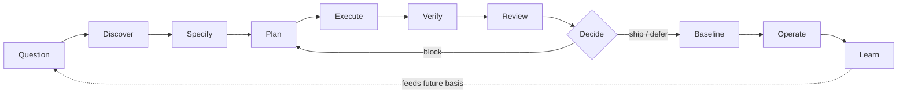
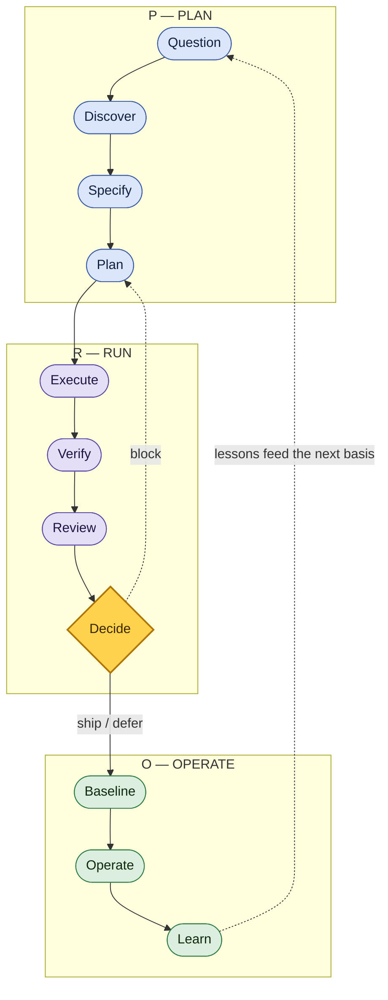
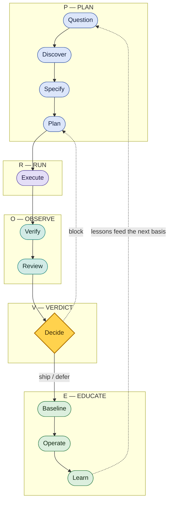
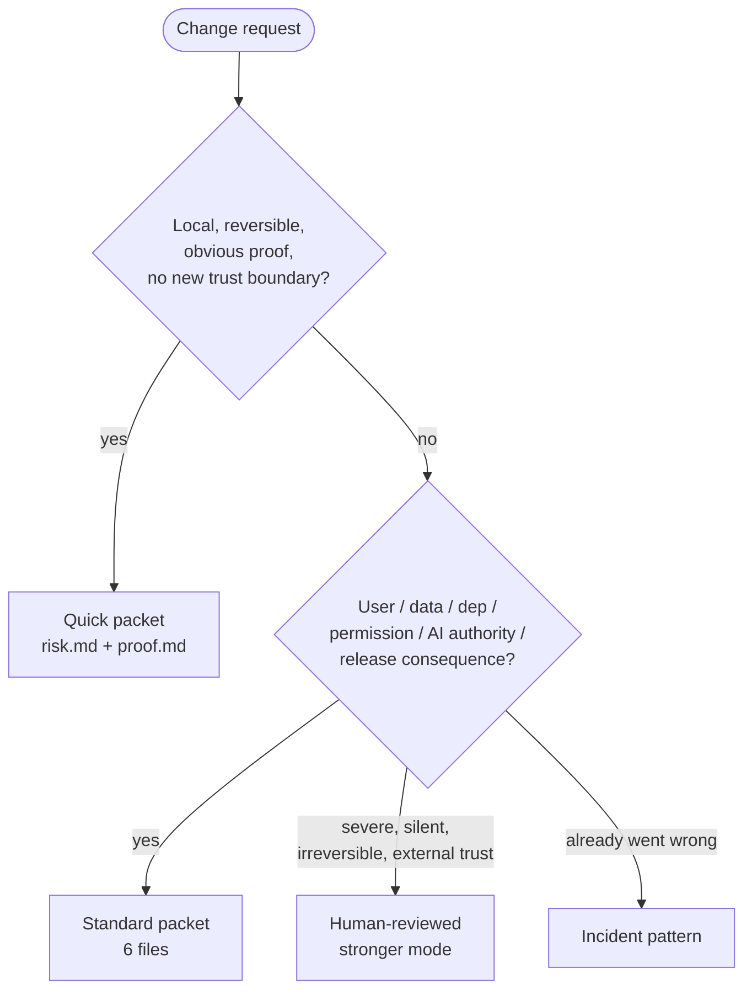
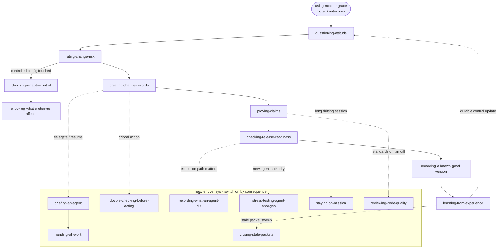
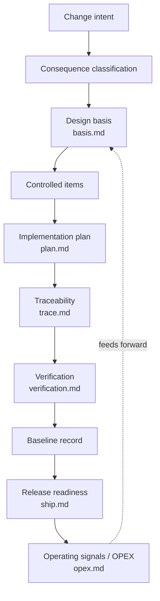
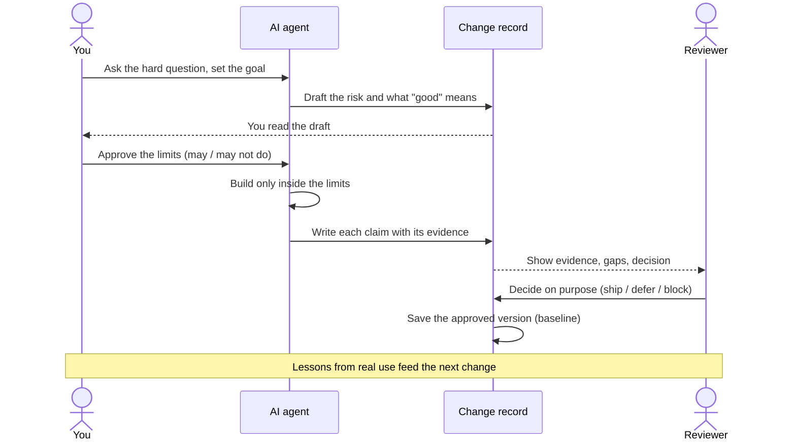
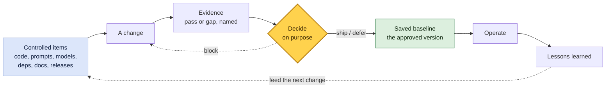

# Nuclear-grade Diagrams

Visual maps of the workflow. These are the canonical source for the diagrams embedded across the public docs; update them here and mirror changes where they are referenced.

Diagrams are Mermaid so they render natively on GitHub, stay diffable in version control, and need no build step. Treat each diagram as a controlled item: when the lifecycle, modes, or skill set change, update the matching diagram in the same change.

---

## 1. Core lifecycle

The full lifecycle. The short, at-a-glance version is `question -> specify -> execute -> verify -> decide -> baseline -> operate -> learn` (the eight everyday control points); the full path below splits three of them to reach the eleven beats.

---

## 2. The PROVE path — one path, two zoom levels

The same eleven beats, grouped into a handle you can remember. Zoom out to **PRO** — three moves. Zoom in to **PROVE** — five, with the acceptance gate named on its own. The beats, their order, and the control points are unchanged; this is a label, not a new workflow.

**PRO — the billboard (3):**

**PROVE — the working map (5):**

**Crosswalk — how the zoom levels line up:**

| Full path (11 beats) | PROVE — working map (5) | PRO — billboard (3) |
|---|---|---|
| Question · Discover · Specify · Plan | **P** — Plan | **P** — Plan |
| Execute | **R** — Run | **R** — Run |
| Verify · Review | **O** — Observe | ↳ inside Run |
| Decide | **V** — Verdict | ↳ inside Run |
| Baseline · Operate · Learn | **E** — Educate | **O** — Operate |

PROVE and PRO are memory handles for the same eleven-beat path; the [eight control points](../WORKFLOWS.md) are the everyday short form of those eleven beats, and the [Core 7](../CORE.md) are always-on habits, not path stages. One letter is reused across the two zoom levels — **O** is *Observe* (Verify · Review) in PROVE but *Operate* (run it in the world) in PRO — so when they differ, read the crosswalk above, not the letter. "PROVE" names the prove-your-claims habit — evidence behind every claim — not formal proof or verification.

---

## 3. Mode decision tree

Which packet mode a change earns. Rigor scales with consequence, not effort tolerance.

---

## 4. Skill-relationship graph

How the skills compose. `using-nuclear-grade` is the single way in and the router; the main path is the per-change pipeline; the heavier overlays switch on only when the stakes call for them.

---

## 5. Packet artifact-dependency graph

How a Standard packet's records depend on each other. Later records point back to the basis they depend on; operating lessons feed forward into the next change. The text form lives in [`00-standards-foundation/artifact-dependency-graph.md`](00-standards-foundation/artifact-dependency-graph.md).

---

## 6. Who does what in one change

How four roles hand off authority over a single change: **you**, the **AI agent**, the **change record**, and the **reviewer**. The agent moves fast inside limits you approved first; the record carries the claims and their evidence; the reviewer decides on the evidence, not the pitch. Read top to bottom.

**In words (text fallback):** you ask + set the goal → agent drafts the risk and the definition of "good" → you approve the limits → agent builds only inside them → agent writes each claim with its evidence → reviewer checks the evidence and decides (ship / defer / block) → the approved version is saved as the baseline → lessons from real use feed the next change.

---

## 7. Keeping the approved version under control

The configuration-management loop in one picture. A **baseline** is the version everyone agreed is correct and wants to protect. Changes do not edit the baseline directly — they go through evidence and a decision first, and only an accepted change becomes the new baseline.

**In words (text fallback):** controlled items (code, prompts, models, dependencies, docs, releases) → a change → named evidence (pass or gap) → a deliberate decision → if ship/defer, save the new baseline; if block, back to the change → operate the baseline → lessons learned feed the next change to the controlled items.

---

## Source-lineage note

These diagrams are an original visual restatement of the Nuclear-grade workflow, influenced by public lifecycle, configuration-management, and software-assurance sources mapped in [`00-standards-foundation/source-map.md`](00-standards-foundation/source-map.md). They do not create formal V&V, compliance, certification, safety, security, or regulatory adequacy.
