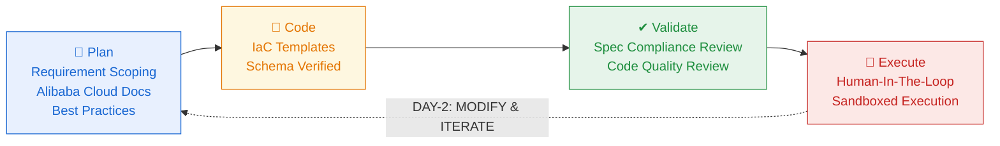

# alibabacloud-spec-ops

> A complete **infrastructure operations methodology** for coding agents on Alibaba Cloud.
> Don't let agents blindly write Terraform — make them **think like an architect, validate like a reviewer, execute like an SRE, and iterate continuously**.

## TL;DR — One command, full SDD treatment

```text
/alibabacloud-spec-ops:alibabacloud-planning   I need a web app on aliyun
```

Then you get:

- 🧠 **一组阿里云专家**陪你**澄清需求** —— Security / Cost / Efficiency / Stability 四维度逐项问诊，把模糊的"我想要个 web app"挖成精确的架构方案
- 📝 **schema-verified Terraform** —— IaCService 实时校验，不胡编资源属性
- ✅ **双独立 reviewer 并行评审** —— spec 满足度 + 代码质量，挡在执行之前
- 🚀 **远程沙箱执行** —— IaC Service 帮你跑 plan + apply，一次授权一气呵成，全链路审计
- ↻ **可持续迭代的设计 + 状态** —— `design.md` 和远程 `state_id` 跨会话保留，Day-2 一句"升配 RDS"就在原有基础上做增量，不重建已有资源

## Workflow at a Glance



Two infrastructure lanes run underneath every stage:

- **MCP (Alibaba Cloud CLI) drives every stage** — real-time docs lookup, schema verification, remote IaC Service execution
- **Observability (Trace + Telemetry) spans the full lifecycle** — every tool call's duration, status, request-id, and outcome is recorded for audit

## Get Started — Step by Step

### 1. Install the plugin

Recommended:

```bash
npx openplugin aliyun/alibabacloud-agent-toolkit --plugin alibabacloud-spec-ops
```

`openplugin` installs the selected plugin into the detected clients (Claude
Code, Codex CLI, QoderWork) and configures client-specific hooks/MCP wiring.

### 2. One-time prerequisites

- **`aliyun` CLI configured** — `aliyun configure` with a valid AccessKey, or rely on AssumeRole / OIDC / ECS RAM role. The plugin never reads or stores AK/SK itself.
- **`uvx` on PATH** — install via `brew install uv` (macOS) or `curl -LsSf https://astral.sh/uv/install.sh | sh` (Linux/WSL). The plugin's MCP server boots through `uvx alibabacloud.mcp-proxy@latest`.

### 3. Kick off the workflow

Pass your requirement inline (or after the prompt — both work):

```text
/alibabacloud-spec-ops:alibabacloud-planning   I need a web app on aliyun
```

The planner asks 2–8 clarifying questions (Fast Track vs Full Mode auto-picked by complexity), evaluates every key choice across **Security / Cost / Efficiency / Stability**, then proposes 1–3 architectures with cost estimates.

### 4. Approve the design

When the final design + cost estimate is shown, reply **"确认"** (or `confirm`). The plugin then auto-chains the next two stages and renders a 3-task TODO list so you always see how far through the pipeline you are:

```text
writing-plans → terraform-codegen → validate (spec + quality reviewers in parallel)
```

### 5. Approve the deploy — the ONLY user gate

After validation passes, the plugin asks once whether to deploy. Reply **"部署"** (or `yes`). Then `terraform plan` + `apply` run **automatically** through Alibaba Cloud IaC Service — sandboxed, with a full audit trace. You can still interrupt mid-stream if `plan` output reveals anything unexpected; spec-driven failures (e.g. a SKU offline in the target AZ) automatically stop and ask you for a replacement.

### 6. Iterate (Day-2)

Need to scale up or add a service later? Just say it:

```text
/alibabacloud-spec-ops:alibabacloud-planning   RDS 升配到 2C4G + 加一台 ECS
```

The plugin auto-detects the modification intent, loads the previous `design.md`, and continues on the same remote `state_id` — your existing resources stay, only the delta is applied.

## Each Stage in Detail

### 1. Plan — 需求澄清与架构设计

扮演阿里云资深解决方案架构师，像专家问诊一样逐步引导用户澄清需求边界 —— 即使用户表达模糊或不完整，也能通过结构化提问挖掘真实意图。实时调用 MCP 查询阿里云官方文档、产品 API 和最佳实践，**用数据驱动每一个架构决策**。所有关键选型均从 **安全 / 成本 / 效率 / 稳定性** 四维度评估，并给出带理由的明确推荐。

- **快速模式**：2-3 个问题锁定规格
- **完整模式**：四维度逐一深度探索

### 2. Code — IaC 代码生成

将审批通过的架构设计转化为 Terraform HCL 代码。通过专用的 `alibabacloud-terraform-codegen` skill 生成，确保每个资源块均经过 Schema 校验，符合阿里云 Provider 的最新规范。代码按资源类型组织，结构清晰、可维护。

- **快速模式**：单文件 `main.tf`
- **完整模式**：按资源类型拆分

### 3. Validate — 双重独立验证

执行前的质量关卡。派遣两个独立的 AI 子代理**并行**审查：

- **需求满足度审查**（`spec-reviewer`）—— 逐条比对 `design.md`，确保每项需求都在代码中正确实现、无遗漏
- **代码质量审查**（`code-quality-reviewer`）—— 检查安全合规、命名规范、最佳实践和可维护性

加上代码生成阶段已通过的 IaC Service 远程语法校验，**三重保障**确保进入执行的内容质量达标。

- **快速模式**：仅信任上游远程语法校验
- **完整模式**：两个 reviewer 并行 + 上游语法校验

### 4. Execute — 人工确认 + 沙箱执行

通过 MCP 调用阿里云 **IaC Service** 远程执行，全程沙箱隔离、零本地风险。严格遵循 Human-In-The-Loop 原则：

- 用户在 Validate 出口**一次性授权**整条 plan + apply 链路
- 自动展示 `terraform plan` 变更详情，但**不再二次拦截**
- 若 plan 出现非预期破坏性变更（典型 Day-2 中误删资源），主动停下来询问
- **Destroy 必须二次确认**（输入项目名才执行）

每一步操作均有完整审计记录和可追溯 Trace。

### ↻ Day-2 — 持续维护与增量迭代

基础设施不是一次性交付，而是持续演进。当用户说"升配 / 扩容 / 加 Redis"，spec-ops 自动检测变更意图并扫描 `.aliyun-ai-ops-spec/` 已有项目，**先读全原 `design.md` 内化原设计意图**，再加载现有 Terraform 代码和执行历史作为上下文。变更对话以"在已有架构基础上做 delta"的方式进行 —— 只改需要变的部分。然后走同一条 Plan → Code → Validate → Execute 流水线，**复用远程 `state_id`**，在原有资源状态上做增量 plan/apply，不重建已有资源。

每一次迭代都有据可循，源 `design.md` 与 `.tf` 始终同步反映真实部署。

## Quality In, Quality Out

```text
❌ Garbage In, Garbage Out
        vs
💎 Quality In, Quality Out
```

Planning 是入口关卡 —— 让阿里云虚拟专家助理帮你**把需求澄清对、把设计做对**。
Validate 是出口关卡 —— 确保执行前内容质量达标。

| ❌ Without — 临时拼凑、脆弱不可控 | ✅ With — 系统化、可持续迭代 |
| --- | --- |
| 需求模糊就直接写代码 —— 用户无法一次性表达清楚，Agent 也不会主动追问 | 专家诊断式探索 —— 即使用户表达模糊，也能逐步引导澄清真实需求和边界 |
| 没有专家引导澄清边界 —— 模糊需求变成错误假设，固化到基础设施中 | 需求边界先锁定再动手 —— 不在错误假设上浪费一行代码 |
| Agent 盲写 Terraform，反复试错 | MCP 实时数据驱动的架构设计 |
| 无架构评审 —— 遗漏安全漏洞 | 四维评审：安全 / 成本 / 效率 / 稳定性 |
| 无验证关卡 —— 代码与设计意图偏离 | 双独立 Agent 验证，执行前必须通过 |
| 手动 CLI 复制粘贴 —— 无审计追踪 | MCP 远程沙箱执行 —— 零本地风险，全链路审计 |
| 无成本感知 —— 账单惊喜 | 每个决策点都有实时费用估算 |
| 无可观测性 —— 黑盒操作，出问题无从追溯 | 全链路可观测 —— 每次调用的耗时、状态、结果均可追溯 |
| Day-2 变更 —— 每次都从头开始 | Day-2 持续迭代 —— 加载上下文，增量变更，同一条流水线 |

## State Directory

All artifacts live under `.aliyun-ai-ops-spec/{requirement-name}/`:

```text
.aliyun-ai-ops-spec/{name}/
├── designs/
│   ├── design.md              # Architecture design + Decisions Log
│   ├── architecture.html      # Optional visual diagram
│   └── terraform/             # Generated HCL
└── tasks/
    ├── status.json            # Pipeline state + state_id for Day-2
    ├── validation-report.md
    ├── tf-plan-result.md
    └── tf-apply-result.md
```

`status.json` carries the IaC Service `state_id` so the next iteration continues on the same remote state instead of recreating resources.

## Install

Recommended:

```bash
npx openplugin aliyun/alibabacloud-agent-toolkit --plugin alibabacloud-spec-ops
```

To target one client only, add a client flag:

```bash
npx openplugin aliyun/alibabacloud-agent-toolkit --plugin alibabacloud-spec-ops --claude
npx openplugin aliyun/alibabacloud-agent-toolkit --plugin alibabacloud-spec-ops --codex
npx openplugin aliyun/alibabacloud-agent-toolkit --plugin alibabacloud-spec-ops --qoderwork
```

## MCP

This plugin configures an MCP server named `alibabacloud-spec-ops` without a safety policy by default, allowing access to all Alibaba Cloud CLI commands. For production environments, configure a safety policy to restrict the callable command set:

```json
{
  "mcpServers": {
    "alibabacloud-spec-ops": {
      "command": "uvx",
      "args": [
        "alibabacloud.mcp-proxy@latest",
        "--safety-policy",
        "iacservice:*=allow,ecs:*=allow,vpc:*=allow,rds:*=allow,*=deny"
      ]
    }
  }
}
```

The server is named distinctly from `alibabacloud-core` to avoid namespace collision when both plugins are installed simultaneously.

## Skills

| Skill | Description |
|-------|-------------|
| `alibabacloud-planning` | Clarify requirements and design Alibaba Cloud architectures (Day-1 / Day-2) |
| `alibabacloud-writing-plans` | Convert approved designs into Terraform HCL via the codegen skill |
| `alibabacloud-terraform-codegen` | Generate and modify Alibaba Cloud Terraform HCL code |
| `alibabacloud-validate` | Dual review (spec compliance + code quality) — auto-runs after codegen |
| `alibabacloud-executing-plans` | Execute validated Terraform plans through Alibaba Cloud IaC Service |
| `alibabacloud-ram-permission-diagnose` | Diagnose and repair RAM permission errors (403 / NoPermission / etc.) |

## Agents

| Agent | Purpose |
|-------|---------|
| `spec-reviewer` | Verify generated Terraform implements every requirement in `design.md` |
| `code-quality-reviewer` | Evaluate Terraform for quality, security, and best practices |

Both agents are dispatched in parallel by `alibabacloud-validate`.

## Hooks

Telemetry and local trace hooks live at [`./hooks/`](./hooks/) as a real directory (no symlinks). The implementation is byte-identical to the canonical copy in [`plugins/alibabacloud-core/hooks/`](../alibabacloud-core/hooks/), which is the source of truth across the toolkit. See [`./hooks/README.md`](./hooks/README.md) for the full event reference, file structure, and the rationale behind this convention.
